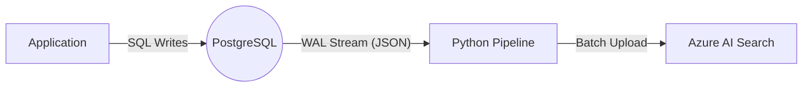

# CDC Pipeline POC: Technical Documentation

**Project:** PostgreSQL to Azure AI Search Change Data Capture (CDC) Pipeline  
**Author:** GitHub Copilot  
**Date:** February 3, 2026

---

## 1. Introduction

This project implements a **Change Data Capture (CDC)** pipeline. Its purpose is to synchronize data in near real-time from a primary source database (**PostgreSQL**) to a search engine (**Azure AI Search**) without modifying the main application logic.

### What is CDC?
**Change Data Capture** is a design pattern that identifies and tracks changes made to data in a database (Inserts, Updates, Deletes) and delivers those changes to a downstream system. Unlike "polling" (where you query `SELECT * FROM table` every minute), CDC reads the database's internal transaction logs, making it extremely efficient and event-driven.

---

## 2. Architecture Overview

The system consists of three main stages:

1.  **The Source (PostgreSQL):** Captures changes in its Write-Ahead Log (WAL).
2.  **The Pipeline (Python Script):** Acts as a stream consumer. It reads the WAL, transforms the data, buffers it, and sends it to the destination.
3.  **The Destination (Azure AI Search):** Stores the data in an inverted index for fast full-text search.



---

## 3. Key Concepts & Components

### A. PostgreSQL & The WAL
*   **WAL (Write-Ahead Log):** Before PostgreSQL writes data to the actual table files (which is slow), it appends the change to a "Log File" (which is fast). This log contains the history of every single change ever made.
*   **Logical Replication:** A fancy term for "decoding" that binary WAL file into a human-readable stream of changes for specific tables.
*   **wal2json:** This is a PostgreSQL **output plugin**. It takes the raw, binary internal data from the WAL and converts it into a clean JSON format (e.g., `{"kind": "insert", "table": "customers", ...}`).
*   **Replication Slot:** A bookmark mechanism. PostgreSQL maintains a "Slot" for our pipeline. It remembers exactly where we left off. If the pipeline crashes for 2 days, the Slot ensures PostgreSQL keeps the logs for those 2 days so we can catch up when we restart.

### B. The Python Pipeline (`src/pipeline.py`)
*   **Listener:** Uses `psycopg2` to connect to the Replication Slot using the streaming protocol.
*   **Parser:** Reads the JSON messages from `wal2json`.
*   **Buffer:** Accumulates messages in memory (Batching) to avoid sending a network request to Azure for every single row.
*   **Checkpointing:** Tracks the **LSN (Log Sequence Number)**—a unique ID for every byte in the WAL. Once a batch is safely in Azure, the pipeline tells Postgres: *"I have processed up to LSN X"*.

### C. Azure AI Search
*   **Index:** Similar to a database "Table", but optimized for text search.
*   **Documents:** The JSON objects stored in the index.
*   **Merge Or Upload:** A helpful feature where we can send partial data. If we send `{"id": "1", "email": "new@test.com"}`, Azure will update *only* the email for document "1" without erasing the name.

---

## 4. Detailed Data Flow

Here is the lifecycle of a single data change through the system:

### Step 1: The Transaction
A user registers on your website. The app runs:
```sql
BEGIN;
INSERT INTO customers (id, name) VALUES (101, 'Alice');
COMMIT;
```
*Note: The data is written to the WAL. Because of the `COMMIT`, it is effectively "released" for replication.*

### Step 2: Decoding
PostgreSQL sees the new data in the WAL. The **Replication Slot** is active, so it calls the **wal2json** plugin.
*   **Input:** Binary Postgres Page Data.
*   **Output (JSON):**
    ```json
    {
        "change": [
            {
                "kind": "insert",
                "table": "customers",
                "columnnames": ["id", "name"],
                "columnvalues": [101, "Alice"]
            }
        ]
    }
    ```

### Step 3: Consumption & Transformation
The `CDCPipeline` script is waiting on a socket (`select.select`). It receives this packet.
*   **Transformation:** It maps database columns to search fields.
    *   `first_name` + `last_name` $\rightarrow$ `full_name`
    *   `id` $\rightarrow$ `id` (Converted to string)
*   **Buffering:** The transformed document is added to a list `self.batch_actions`.

### Step 4: Batch Flush
Once the buffer hits `BATCH_SIZE` (50) or `FLUSH_TIMEOUT` (5s):
1.  **Push:** Sender calls `search_client.merge_or_upload_documents(batch)`.
2.  **Verify:** Waits for Azure to return "Success" (HTTP 200).

### Step 5: Deep Dive into LSN & Acknowledgment
The **Log Sequence Number (LSN)** is the backbone of reliability in this pipeline.

#### 1. What is an LSN?
An LSN is simply a pointer to a byte offset in the WAL (Write-Ahead Log) file. It looks like `16/B374D848`.
*   Think of the WAL as an infinitely long tape recording of transactions.
*   The LSN is the "timestamp" or "counter" written on that tape.

#### 2. The Critical Handshake
When our pipeline processes a batch, the following "Handshake" ensures data integrity:

1.  **Receive:** PostgreSQL sends a message: *"Here is data payload X. It ends at LSN `0/1500`."*
2.  **Buffer:** The Python script stores this in RAM `self.batch_actions` and remembers `self.latest_lsn = '0/1500'`.
    *   *Crucial Point:* At this moment, PostgreSQL considers this message **"Unconfirmed / Pending"**.
    *   If the network cable is cut now, PostgreSQL assumes the data was lost.
3.  **Action:** The script flushes the batch to Azure AI Search.
4.  **Verify:** The script receives `HTTP 200 OK` from Azure. This confirms the data is durable in the destination.
5.  **Acknowledge (Feedback):** Only now does the script call `send_feedback(flush_lsn='0/1500')`.
    *   This sends a small binary packet back to PostgreSQL on the replication stream.
    *   **PostgreSQL's Reaction:** "Okay, Client `cdc_slot` has safely stored everything up to `0/1500`. I can now delete those WAL logs from disk to free up space (WAL recycling)."

#### 3. Why this matters (The Crash Scenario)
If the Python script crashes at **Step 3** (during upload):
*   Azure might have 0 records (if request never left) or partial records.
*   The ACK at **Step 5** never happens.
*   **Result:** The Postgres Replication Slot cursor stays at `0/1499`.
*   **Recovery:** When the script restarts, it connects to the slot. Postgres sees the cursor is at `0/1499` and **Resends the data starting from 0/1500**.
*   This mechanism guarantees **At-Least-Once Delivery**.

---

## 5. Technical Configurations

### Database Setup (`src/db_setup.py`)
We configured the tables with:
```sql
ALTER TABLE customers REPLICA IDENTITY FULL;
```
**Why?** By default, on an `UPDATE`, Postgres only logs the *new* values. If you change a name, it logs the new name but not the ID. To delete or update a record in search, we need to know the **Primary Key** of the row being changed. `REPLICA IDENTITY FULL` forces Postgres to include the Primary Key in the log even for updates/deletes.

### Docker Environment (`docker-compose.yml`)
We switched from the standard `postgres:15` image to `quay.io/debezium/postgres:15`.
**Why?** The standard image does not include the `wal2json` plugin. The Debezium image comes pre-packaged with all major CDC plugins.

---

## 6. How it handles Complexity

### Handling Multiple Tables
We have two source tables: `customers` and `addresses`.
*   **Problem:** Search indexes are "flat" (one document per customer).
*   **Solution:** Both tables map to the **Same Document ID** in Azure.
    *   `customers` table updates fields `full_name`, `email`.
    *   `addresses` table updates fields `street`, `city`.
    *   Azure simply merges them. It doesn't matter which order they arrive in.

### Handling Crashes (At-Least-Once Delivery)
If the Python script crashes while holding 49 records in buffer:
1.  Azure receive 0 records.
2.  Postgres receives **no** acknowledgment.
3.  On restart, Postgres sees the LSN is old, and **resends** those 49 records.
4.  **Result:** No data loss.

---

## 7. Operational Guide

### Prerequisites
*   Docker & Docker Compose
*   Python 3.10+
*   Azure AI Search Service (Endpoint & Key)

### Running the System
1.  **Start Database:**
    ```bash
    docker-compose up -d --build
    ```
2.  **Initialize Schema:**
    ```bash
    python src/db_setup.py
    ```
3.  **Setup Search Index:**
    ```bash
    python src/search_setup.py
    ```
4.  **Start Pipeline:**
    ```bash
    python src/pipeline.py
    ```
5.  **Generate Load (Optional):**
    ```bash
    python src/bulk_insert.py
    ```

---

## 8. Glossary

*   **CDC:** Change Data Capture.
*   **WAL:** Write-Ahead Log (Postgres's journal).
*   **LSN:** Log Sequence Number (An address in the WAL).
*   **Slot:** A cursor in the WAL stream maintained by the DB.
*   **ETL:** Extract, Transform, Load (Traditional batch process, slower than CDC).
*   **Dual Write:** Anti-pattern where app writes to DB and Search manually side-by-side.
